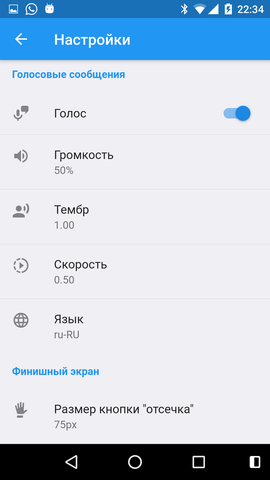
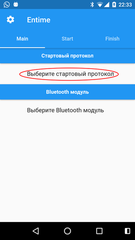

# Entime mobile

Для непосредственной работы нужно выбрать файл стартового протокола. Поддерживается загрузка списка участников из csv файлов. Формат следующий:

| category | number | name | nickname | age | team | city | starttime |
|----------|--------|------|----------|-----|------|------|-----------|

Единственный необходимый столбец - number(номер участника), порядок столбцов не важен, заголовки обязательны.

Затем bluetooth модуль, который предварительно должен быть сопряжён с мобильным устройством.

После выбора bluetooth модуля, нужно нажать на любой из появившихся bluetooth значков, для соединения с модулем.

После установки соединения, можно ~~изменить~~ пока только посмотреть настройки модуля.

Для работы на старте переходим во вкладку "Start", в ней отображается стартовый протокол.

В первом столбце номер участника, во втором - плановое стартовое время, в третьем - реальное стартовое время (поступает от стартового модуля), в четвёртом - поправка в миллисекундах относительно планового времени старта.

| Номер | Время старта | Фактическое время старта | Поправка |
|-------|--------------|--------------------------|----------|

Если участник не стартовал, выставить DNS можно свайпом в левую сторону на строке с нужным номером.

После окончания стартов передать результаты можно нажав стандартную кнопку **share** вверху.

При нажатии на синий плюс внизу, можно добавить нового участника, либо изменить время старта уже существующего.

Для этого в открывшемся диалоге вводим номер и новое стартовое время.

Для работы на финише переходим во вкладку "Finish", в ней отображаются финишные времена, введённые либо вручную, при нажатии на иконку руки внизу экрана, либо полученные от финишного модуля. Значок слева поможет определить, как именно было получено значение времени финиша.

Внизу отображаются номера гонщиков, которые сейчас должны быть на трассе.

Для присвоения номеру времени финиша, либо перетащите номер снизу на нужное время, либо выставите номер вручную из диалога, который появится при нажатии на любое значение времени в основной таблице.

Отработанные, либо ненужные времена финиша, можно либо скрывать поодиночке свайпом в любую сторону,

либо сразу все из всплывающего меню, которое появляется при долгом нажатии на любом значении времени.

После окончания заездов передать результаты финиша можно нажав стандартную кнопку **share** вверху.

Нектороые настройки приложения.

- Включить звук обратного отсчёта
- Включить и настроить голосовые оповещения
- Отключить выключение эрана во время работы приложения.